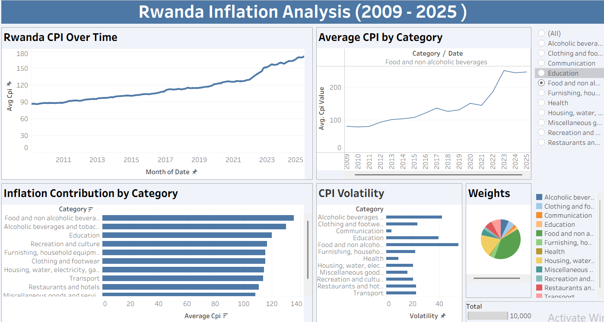

# Rwanda Consumer Price Index (CPI) analysis

 ## Project overview

This project analyzes Rwanda’s Consumer Price Index (CPI) data to understand inflation trends, price behavior, and price volatility over time. The analysis focuses on identifying which product categories drive inflation and how price changes may affect household cost of living.

### Objectives

- To analyze overall CPI trends over time
- Compare CPI behavior across different categories
- Identify categories with the highest price volatility
- Translate results into economic insights

### Tools

- `Python (Pandas)`: Data cleaning, reshaping, and preprocessing
- `SQL (MySQL)`: Data storage, aggregation, and statistical analysis
- `Tableau Public`: Interactive data visualization and dashboard creation

### Analyses

- **Overall CPI trend:** Long-term inflation pattern in Rwanda
- **CPI by category:** Comparison of price movements across sectors
- **Average CPI by category:** Identifying categories with consistently higher prices
- **Price volatility:** Measuring instability using standard deviation

### Key insights

- Inflation in Rwanda shows a sustained upward trend over time
- Essential goods, particularly food categories, contribute most to inflation
- CPI volatility is higher in essential categories, indicating exposure to supply and seasonal shocks
- Inflation pressures are sector-driven rather than uniform across the economy

### Dashboard

**The following visual is a screenshot but the Tableau dashboard can be viewed here:**
**[Rwanda CPI Dashboard](https://public.tableau.com/app/profile/derrick.kirezi/viz/rwanda_cpi/Dashboard1?publish=yes)**

